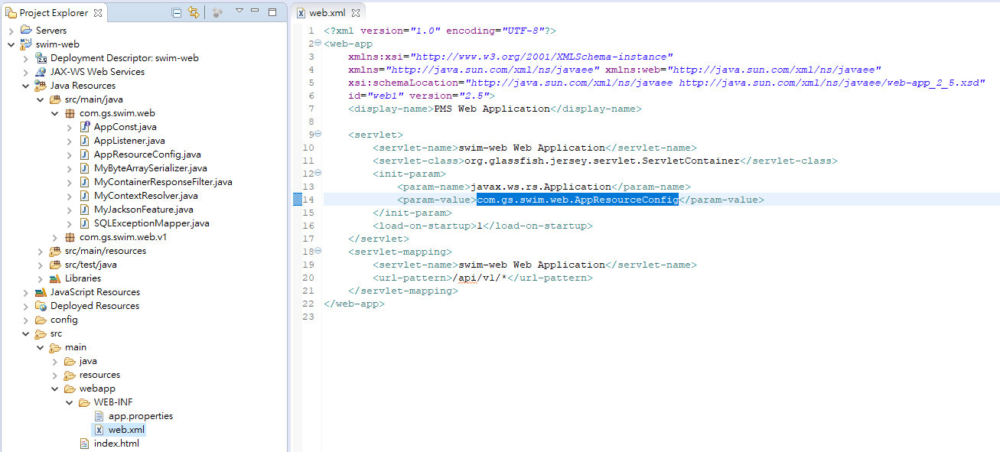
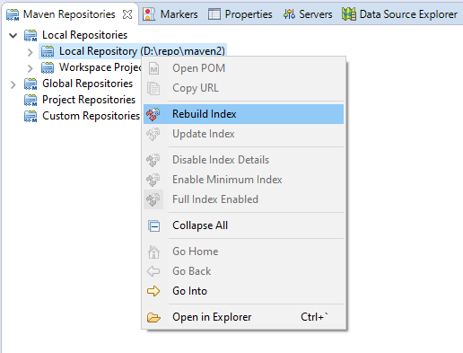

Maven Archetype of RESTful API
===
## Description

The archetype can generate a Maven project to develop a RESTful API application.

The generated project is configured ready:
* Listener
* Response Filter
* Simple API implementation for testing
* SQLException Mapper
* __app.properties__ support
* __profile__ support



### AppResourceConfig.java
Setup package to be scanned and register some filters.
```java
public class AppResourceConfig extends ResourceConfig {

    public AppResourceConfig() {
        packages("com.gs.swim.web.v1");

        register(SQLExceptionMapper.class);

        register(MyContainerResponseFilter.class);
        register(MyContextResolver.class);
        register(MyJacksonFeature.class);
    }
```

### SystemWebService.java
A simple service at `/api/v1/system` endpoint:
```java
@Path("/system")
public class SystemWebService extends AbstractWebService {
}
```

## How to Use
### Install to the local repository
1. clone this source and open by Eclipse IDE
2. Install the archetype to local m2 repository

  

3. Reindex local repository

  

### New Maven Project
1. Check __Include snapshot archetypes__ to display SNAPSHOT items.
2. Select __uia-archetype-restful__

  
